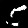
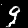

# Conditional Deep Convolutional Generative Adversarial Network (cDCGAN) | on the MNIST DataSet

___
## Training Loss Analysis
  |  |  |
|--------------------------|--------------------------------------|--------------------------------------|

### 1. D trained **every** iteration:

- D performs too well (low D loss).
- G can’t keep up (high G loss).

### 2.   D trained **2×** less frequently:
- The generator still struggles to catch up (G loss is higher than D loss).

### 3. D trained **3×** less frequently:

- Possibly a much better result (G loss is lower than D's).
- However, the trend suggests a role reversal, which is not desirable.

(alternative - decreese D's  learning rate)

### More traning data with D trained 3x less frequently:
  |  |
|--------------------------|------------------------------------------------|

The plot flips here, indicating the G started to fail. I think that best performance was likely around 30 iterations (see second plot).

### Summary:
Training the D too often hinders the G’s laearning. Training it too rarely weakens its ability to distinguish. The best results come from balancing the learning pace of both networks.

#### 📈 Legend 

| Symbol | Meaning               |
|--------|------------------------|
| 🟥 Red line   | Discriminator loss      |
| 🟦 Blue line  | Generator loss          |
| **D**        | Discriminator            |
| **G**        | Generator                |
| 📊           | Average loss per epoch   |

___

## Generated numbers by the trained model (0-9):

 |  |  |  |  |  |  |  |  |  |
|---|---|---|---|---|---|---|---|---|---|

## Inerpolation

1 -> 9

